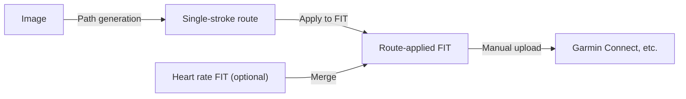

# track-remap

A JS library that generates routes from images and applies them to indoor trainer ride logs for upload to Garmin Connect and similar platforms.

For example, you can combine an illustration or photo-based single-stroke route with a spin bike ride log (FIT file) and see it displayed like this on Garmin Connect:  
https://connect.garmin.com/app/activity/22465897318

> **What is a FIT file?** An activity recording format used by Garmin and other sports devices. It stores time-series data such as position, heart rate, and speed.

## What It Does



1. **Image → Route**: Load an image (illustration or photo) and generate a single-stroke route (coordinate array)
2. **Route → FIT**: Apply the route to an existing FIT file and output a new FIT
3. **Heart rate merge (optional)**: Merge heart rate data recorded on a separate device

Note: This library handles FIT file generation only. Upload to Garmin Connect etc. must be done manually.

## Quick Start

### Run the Demo

```bash
docker compose up -d
# → http://localhost:5000/demo.html
```

### Use from Code

Load `dist/track-remap.min.js` in the browser to access the global `TrackRemap` object.

```js
// 1) Generate route from image
const { path, width, height } = await TrackRemap.imageFromFile(imageFile);

// 2) Apply to FIT
const { appliedPoints, fitBlob } = await TrackRemap.applyPathToFIT(
  { path, width, height },
  fitFile
);

// 3) Merge heart rate data (optional)
const merged = await TrackRemap.mergeFITSensorData(
  appliedPoints,
  sensorFitFile,
  { routeFitForSessionLap: fitBlob }
);

// 4) Download
const a = document.createElement('a');
a.href = URL.createObjectURL(merged.fitBlob);
a.download = 'route.fit';
a.click();
```

## Choosing Images and the Two Modes

Choose `routeMode` based on the type of image.

| Mode | Best for | How it works |
|------|----------|--------------|
| **`density`** (default) | Photos, images with gradients | Detects edges and connects points via Traveling Salesman Problem (TSP) |
| **`strokeTrace`** | Simple line art, illustrations | Thins lines down and traces along them |

**Tip**: Simpler images produce cleaner routes. For complex photos, converting to simple line art using AI (Gemini, etc.) first tends to give better results.

---

## API

The second argument `options` is optional for all functions (library defaults are used when omitted).

### Image → Path

Loads an image file and generates single-stroke route coordinates.

| Function | Description |
|----------|-------------|
| **`TrackRemap.imageFromFile(file, options)`** | Generate path from an image `File` |
| **`TrackRemap.imageFromURL(url, options)`** | Generate path from an image URL |

Returns: `Promise<{ path, width, height, modeUsed, metrics }>`

| Property | Description |
|----------|-------------|
| **`path`** | Normalized coordinates (0–1) in `[[x, y], ...]` format. Pass this when applying to FIT |
| **`width`** / **`height`** | Processed image dimensions (px). Used to maintain aspect ratio |
| **`modeUsed`** | The mode actually used (`density` or `strokeTrace`) |
| **`metrics.points`** | Total number of path points |
| **`metrics.length`** | Total path length (distance in normalized coordinates) |
| **`metrics.selfIntersections`** | Number of self-intersections in the path |

#### options — Basic

| Option | Default | Description |
|--------|---------|-------------|
| **routeMode** | `density` | `density` for photos, `strokeTrace` for line art |
| **maxPoints** | 1500 | Maximum number of output path points |
| **maxSize** | 0 | Resize image long edge to specified px. **0 keeps original size** |
| **onProgress** | — | Callback to receive progress updates and previews |

#### options — `density` Mode

| Option | Default | Description |
|--------|---------|-------------|
| **thresholdLow** / **thresholdHigh** | Library default | Controls what counts as an "edge" in the image. Lower values pick up finer lines; higher values keep only sharp edges |
| **thinEdges** | `false` | Thins detected edges down to 1px width. Useful for reducing point count |
| **useCenterline** | `false` | Thick lines (like marker strokes) get detected as two parallel edges. Set to `true` to use only the center line |
| **edgesOverride** | — | Bypass the library's edge detection and supply your own binary mask (`Uint8ClampedArray`) directly. Takes priority over the options above |

#### options — `strokeTrace` Mode

| Option | Default | Description |
|--------|---------|-------------|
| **inkThreshold** | 200 | How dark a pixel must be to count as a "line" (0–255). Higher values pick up lighter lines; lower values keep only dark ones |
| **bridgeMode** | `avoidInk` | How to connect separate lines. `avoidInk`: route around through white areas, `straight`: connect with a straight line |
| **maxBridgeSteps** | Auto | Maximum steps for detour route search. Increase for large images where detours are insufficient (increases processing time) |
| **edgesOverride** | — | Bypass the library's line detection and supply your own binary mask (`Uint8ClampedArray`) to be traced directly |

### Apply Path to FIT

Replaces the route in an existing FIT file with the generated route coordinates and outputs a new FIT.

**`TrackRemap.applyPathToFIT(imagePathResult, fitFileOrBuffer, options)`**

| Argument | Type | Description |
|----------|------|-------------|
| **imagePathResult** | `{ path, width, height }` | Return value from `imageFromFile` etc. |
| **fitFileOrBuffer** | `File` \| `ArrayBuffer` | Route FIT file |
| **options.center** | `{ lat, lng }` | Override the route center position. Uses the original FIT position when omitted |

Returns: `{ appliedPoints, fitBlob }`

### Merge Heart Rate FIT (Optional)

Merges sensor data (heart rate, power, etc.) recorded separately on a Garmin or similar device into the route-applied FIT.

**`TrackRemap.mergeFITSensorData(appliedPoints, sensorFitFileOrBuffer, options)`**

| Argument | Type | Description |
|----------|------|-------------|
| **appliedPoints** | Array | Return value from `applyPathToFIT` |
| **sensorFitFileOrBuffer** | `File` \| `ArrayBuffer` \| `Blob` | Heart rate FIT file |
| **options.routeFitForSessionLap** | `Blob` \| `ArrayBuffer` \| `File` | Pass the FIT created by `applyPathToFIT`. When provided, summary info like total distance and speed is correctly calculated from the route data |

Returns: `{ appliedPoints, fitBlob }`

### Preprocessing / Preview API (Advanced)

For inspecting edge detection results or running preprocessing and route generation as separate steps.

| Function | Description |
|----------|-------------|
| `imagePreprocessGrayFromFile` / `FromArrayBuffer` / `FromURL` | Convert to grayscale (`maxSize` only) |
| `imageGrayToRgba(gray)` | Convert grayscale to Canvas-compatible RGBA |
| `imageEdgePreviewFromGray(gray, options)` | Generate preview image of edge detection results |
| `imageEdgesFromGray(gray, options)` | Get edge mask |
| `imageCenterlineFromGray(gray, options)` | Get centerline mask |
| `imagePathFromGray(gray, options)` | Generate path from preprocessed grayscale |

### FIT → Single-Stroke Path (Advanced)

Renders the GPS route from an existing FIT as an image, then generates a single-stroke path from it. Useful for transferring a route shape to a different FIT.

| Function | Description |
|----------|-------------|
| **`TrackRemap.fromFile(file, options)`** | From a `.fit` `File` |
| **`TrackRemap.fromArrayBuffer(buffer, options)`** | From a FIT `ArrayBuffer` |

Returns: `Promise<{ path, width, height, points? }>` (`points` contains the original FIT lat/lng array)

| Option | Default | Description |
|--------|---------|-------------|
| **routeWidth** | 800 | Preview image width |
| **routeLineWidth** | 2 | Line thickness |
| **routePadding** | 20 | Padding |
| **maxPoints** / **maxSize** / **thresholdLow** / **thresholdHigh** / **thinEdges** | Library default | Image-to-path options |

---

## Route + Heart Rate Merge

When you record only the route on a spin bike etc. and heart rate separately on a Garmin, use `mergeFITSensorData` to combine both into a single FIT.

- **Route FIT**: FIT with the image path applied (position and timeline serve as the base)
- **Heart rate FIT**: FIT with heart rate, power, cadence, etc. from a Garmin
- Heart rate matching uses the sensor record closest in absolute time to each route point
- When no heart rate FIT is provided, only the path is applied

### Data Sources After Merge

| Type | Field | Source |
|------|-------|--------|
| **Record** | Position, timestamp, distance, speed, altitude | Route FIT |
| | Heart rate | Heart rate FIT (matched by absolute time) |
| | Cadence, power, calories | Route FIT |
| **Session / Lap** | Total distance, elapsed time, speed | Route FIT |
| | Heart rate (avg, max) | Heart rate FIT |
| | Cadence, power, calories | Route FIT |
| | TSS, IF, NP, ascent/descent, altitude summary | Heart rate FIT |

Note: When the route FIT record count doesn't match the points count, cadence/power/calories fall back to the heart rate FIT.

---

## Demo (`demo.html`)

**Launch**: `docker compose up -d` → `http://localhost:5000/demo.html`

### Section 1: Image → Route

1. **Select an image**
2. **Edit image (optional)** — Choose "No edit / Crop only / Edit in detail"
3. **Route settings** — Adjust routeMode, maxPoints, etc.
4. **Preprocessing & edge preview** — Preview grayscale and edge detection
5. **Generate route**

### Section 2: Apply to FIT

Load a FIT (route source) → Confirm center on map → "Apply to FIT" → Save FIT.  
Setting a heart rate FIT (optional) at the same time will also perform the merge.

### Image Editing (Detail)

- **Step 1**: Crop & rotate (Cropper.js)
- **Step 2**: Background removal (optional) — AI ([@imgly/background-removal](https://www.npmjs.com/package/@imgly/background-removal)) + manual brush adjustment
- **Step 3**: Brightness & contrast — Background color, brightness, and contrast with real-time preview

---

## Troubleshooting

**Edges appear almost blank**: The edge detection sensitivity may be too low. **Lower thresholdLow** or increase the image contrast. Use the "gradient preview" in the demo to check.

**Thick lines produce double edges**: Use `useCenterline: true` and adjust `inkThreshold` if needed.

**Too many edges**: (1) Raise thresholdLow / thresholdHigh (2) Reduce maxSize (3) Set `thinEdges: true`

---

## Source Structure (`src/`)

| Directory / File | Role |
|------------------|------|
| `index.js` | Public API entry point |
| `image-to-path/` | Generates single-stroke paths from images |
| `path-to-fit/` | FIT parsing, coordinate conversion, writing, sensor merge |
| `workers/` | Web Worker entries (FIT and image) |

Build output:

| File | Purpose |
|------|---------|
| `dist/track-remap.js` | Unminified bundle (+ sourcemap) |
| `dist/track-remap.min.js` | Minified bundle |
| `dist/track-remap-worker.js` | Web Worker for FIT apply/merge |
| `dist/track-remap-image-worker.js` | Web Worker for image → path |
